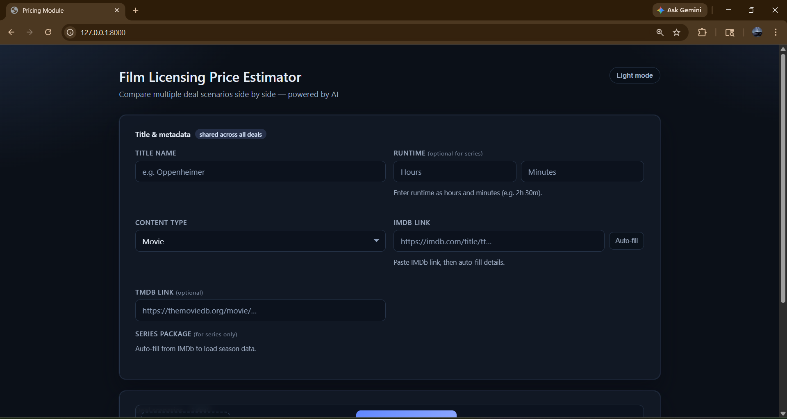
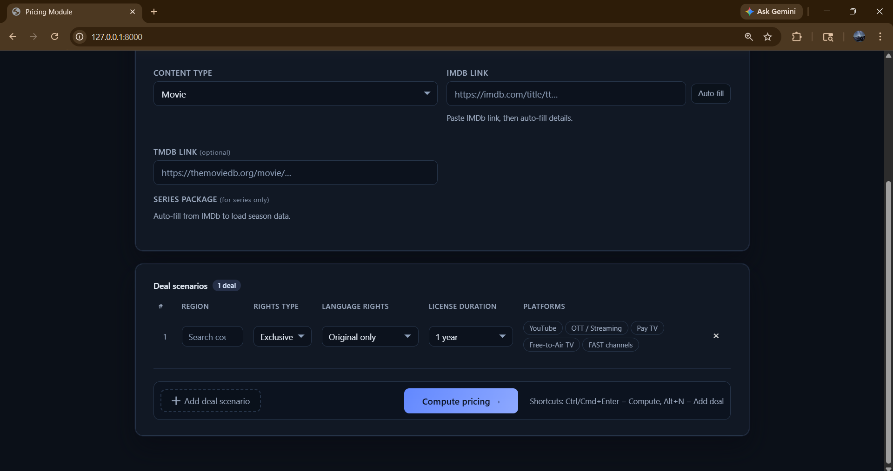
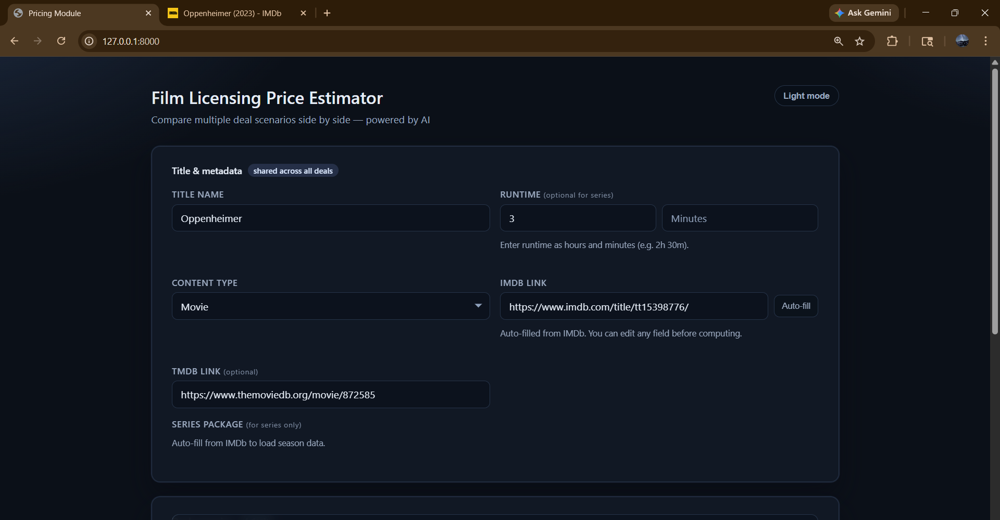
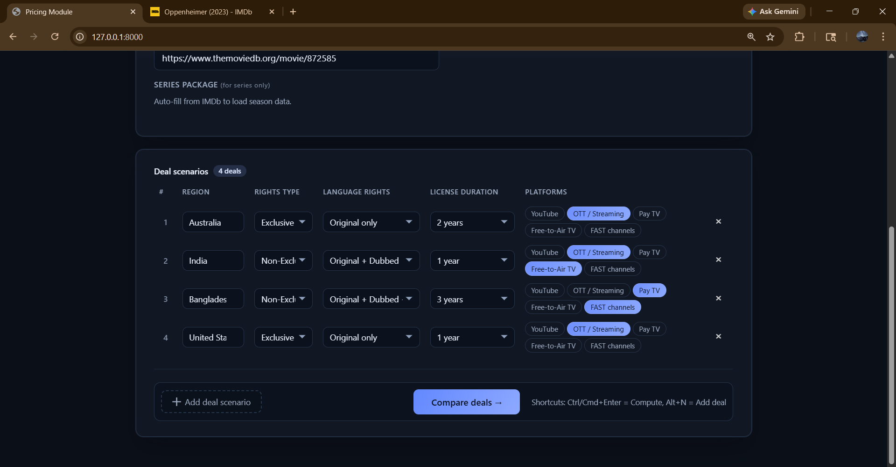
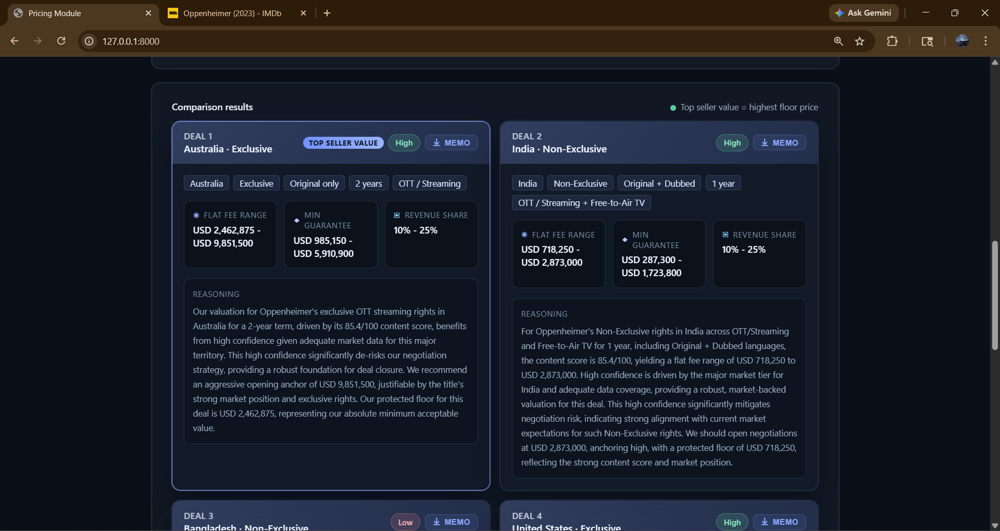
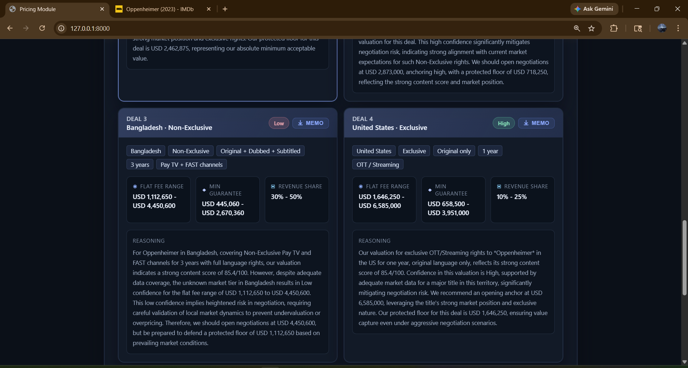
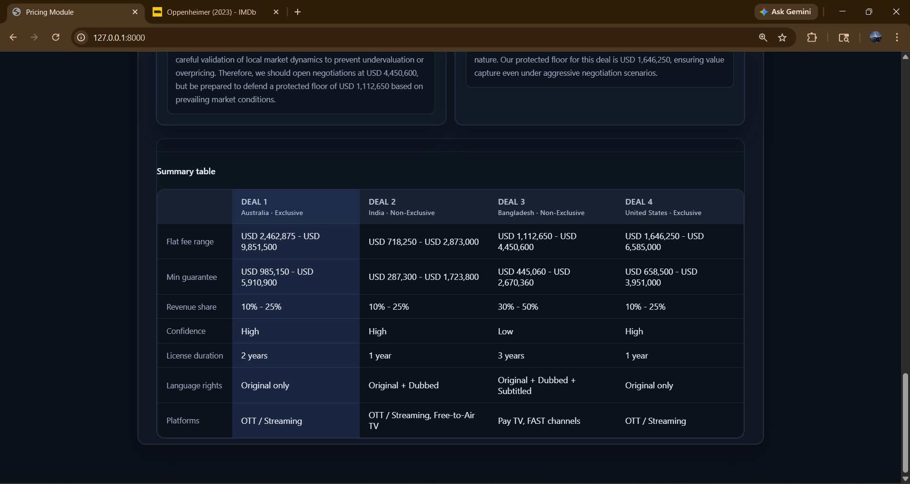
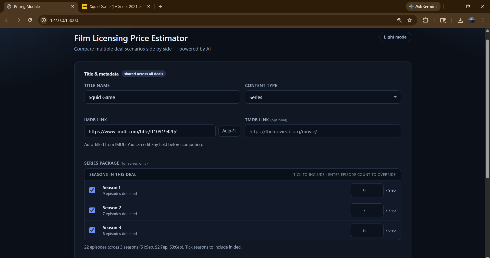
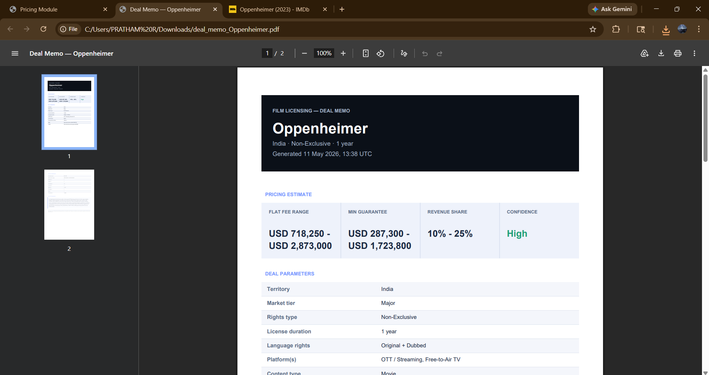

# Film Licensing Price Estimator

AI-assisted film licensing pricing engine built with FastAPI for film and television licensing deals. Compare multiple deal scenarios side by side, powered by AI reasoning with deterministic fallback, and export a professional PDF deal memo for each estimate.

---

## What it does

- **Multi-deal comparison** — run up to N deal scenarios in parallel (different territories, rights types, platforms) against the same title and compare results side by side
- **AI-powered reasoning** — Gemini → Groq → deterministic fallback chain; each estimate includes a plain-English analyst rationale
- **Series season selector** — interactive per-season tick UI; supports full series, partial season packages, and incremental acquisitions (buyer already holds earlier seasons)
- **Per-season episode accuracy** — IMDb per-season episode counts fetched at auto-fill time; episode overrides per season for mid-season or holdback deals
- **PDF deal memo export** — one-click download of a formatted A4 memo per deal: cover, pricing summary, season context banner, deal parameters, pricing components, analyst reasoning
- **SQLite caching** — deal key hashed from all pricing inputs; cache invalidates automatically when model version changes
- **Rate limiting** — in-memory per-IP sliding window
- **Metrics endpoint** — request counts, cache hit/miss ratio, error counts

---

## Screenshots

### Main Dashboard







---

### Multi-Deal Comparison



---

### Multi-region Pricing





---

### Pricing Summary Table



---

### Series Package Detection



---

### PDF Deal Memo Export



---

## Project structure

```
Film_Licensor/
├── main.py           # FastAPI app — models, pricing logic, AI chain, endpoints
├── index.html        # Single-file frontend — served at GET /
├── requirements.txt  # Trimmed dependency list
├── .env              # Environment variables (not committed)
└── pricing_cache.db  # SQLite cache (auto-created on first run)
```

---

## Installation

1. Clone the repository:
   ```bash
   git clone https://github.com/77Pratham/Film_Licensor
   cd Film_Licensor
   ```

2. Create a virtual environment:
   ```bash
   python -m venv venv
   source venv/bin/activate        # Windows: venv\Scripts\activate
   ```

3. Install dependencies:
   ```bash
   pip install -r requirements.txt
   ```

4. Create a `.env` file:
   ```env
   # Database
   DATABASE_URL=sqlite:///pricing_cache.db
   CACHE_TTL_SECONDS=86400

   # Auth (set REQUIRE_API_KEY=true to enforce)
   SERVICE_API_KEY=your_service_key_here
   REQUIRE_API_KEY=false

   # Rate limiting
   RATE_LIMIT_WINDOW_SECONDS=60
   RATE_LIMIT_MAX_REQUESTS=60

   # AI providers (at least one required)
   GEMINI_API_KEY1=your_gemini_key
   GROQ_API_KEY=your_groq_key

   # OMDb (for IMDb auto-fill)
   OMDB_API_KEY=your_omdb_key
   ```

---

## Running the app

```bash
python main.py
```

Open `http://localhost:8000/` in your browser.

---

## API endpoints

| Method | Path | Description |
|--------|------|-------------|
| `GET` | `/` | Web interface |
| `GET` | `/health` | Health check |
| `GET` | `/metrics` | Request metrics |
| `GET` | `/countries` | Supported country list |
| `GET` | `/title-metadata` | Fetch IMDb/OMDb metadata for a title (includes per-season episode breakdown) |
| `POST` | `/estimate` | Generate a pricing estimate |
| `POST` | `/export-memo` | Generate and download a PDF deal memo |

---

## GET /health

**Response**
```json
{
  "status": "ok",
  "service": "pricing-module",
  "model_version": "deterministic_v3",
  "database": {
    "configured_url": "sqlite",
    "ready": true,
    "error": null
  },
  "ai": {
    "gemini_configured": true,
    "groq_configured": true
  }
}
```

`status` is `"ok"` when the database is reachable, `"degraded"` otherwise.

---

## GET /metrics

**Response**
```json
{
  "requests_total": 142,
  "cache_hits": 98,
  "cache_misses": 44,
  "estimate_errors": 1,
  "rate_limited": 0,
  "cache_hit_rate_percent": 69.01
}
```

---

## GET /title-metadata

**Query parameter:** `imdb_link` — full IMDb title URL

**Example**
```
GET /title-metadata?imdb_link=https://www.imdb.com/title/tt10919420/
```

**Response**
```json
{
  "found": true,
  "imdb_id": "tt10919420",
  "title": "Squid Game",
  "content_type": "series",
  "runtime_minutes": 55,
  "total_seasons": 3,
  "released_episode_count": 22,
  "season_episode_counts": {
    "1": 9,
    "2": 7,
    "3": 6
  },
  "released_label": "17 Sep 2021",
  "tmdb_link": "https://www.themoviedb.org/tv/93405"
}
```

`season_episode_counts` maps each season number to its IMDb episode count. The frontend uses this to build the season selector widget and passes it back in the `/estimate` request.

---

## POST /estimate

**Request**
```json
{
  "title": "Squid Game",
  "imdb_link": "https://www.imdb.com/title/tt10919420/",
  "tmdb_link": "https://www.themoviedb.org/tv/93405",
  "content_type": "series",
  "season_count": 3,
  "episode_count": 5,
  "included_seasons": "1,2,3",
  "already_acquired_seasons": "1,2",
  "season_episode_counts": { "1": 9, "2": 7, "3": 6 },
  "episode_overrides": { "3": 5 },
  "region": "India",
  "country_code": "IN",
  "rights_type": "Exclusive",
  "license_duration": "1 year",
  "language_rights": "Dubbed + Subtitled",
  "platforms": ["OTT / Streaming"]
}
```

**Response**
```json
{
  "title": "Squid Game",
  "region": "India",
  "country_code": "IN",
  "market_tier": "major",
  "pricing_estimate": {
    "flat_fee_range": "USD 95,000 - USD 130,000",
    "minimum_guarantee": "USD 38,000 - USD 78,000",
    "revenue_share_range": "10% - 25%"
  },
  "pricing_components": {
    "score": 91.4,
    "base_price_range": "USD 40,000 - USD 70,000",
    "multipliers": {
      "platform": 1.0,
      "rights": 2.5,
      "language": 1.4,
      "license": 1.0,
      "market": 0.62,
      "package": 1.252,
      "age": 1.0,
      "combined": 2.714
    },
    "season_context": {
      "mode": "incremental",
      "included_seasons": "1,2,3",
      "already_acquired_seasons": "1,2",
      "net_new_seasons": [3],
      "net_new_episodes": 5,
      "note": "Incremental acquisition — Season 3 · 5 episodes · Seasons 1,2 already held by licensee."
    }
  },
  "confidence_level": "High",
  "reasoning": "Squid Game commands premium positioning in the Indian OTT market as a proven global phenomenon. Exclusive rights for a 1-year term justify the upper bound. Incremental season 3 acquisition reflects continuation value with the buyer already holding seasons 1–2, moderating uplift versus a fresh multi-season package. We anchor negotiations at USD 130,000 with a protected floor of USD 95,000.",
  "model_version": "deterministic_v3",
  "cache_hit": false
}
```

### `season_context` field

Present only for series deals. Has two modes:

**`incremental`** — buyer already holds some seasons:
```json
"season_context": {
  "mode": "incremental",
  "included_seasons": "1,2,3",
  "already_acquired_seasons": "1,2",
  "net_new_seasons": [3],
  "net_new_episodes": 5,
  "note": "Incremental acquisition — Season 3 · 5 episodes · Seasons 1,2 already held by licensee."
}
```

**`partial`** — fresh deal covering only some seasons:
```json
"season_context": {
  "mode": "partial",
  "included_seasons": "1,2",
  "season_ratio_pct": 67,
  "net_new_episodes": 16,
  "note": "Partial series — Seasons 1,2 of 3 total · 67% coverage · 16 episodes priced."
}
```

`season_context` is `null` for full-series or movie deals.

### Key series request fields

| Field | Description |
|-------|-------------|
| `included_seasons` | Seasons in scope for this deal (e.g. `"1,2,3"` or `"1-3"`). Leave blank for full series |
| `already_acquired_seasons` | Seasons the buyer already holds — triggers incremental pricing |
| `season_episode_counts` | Per-season IMDb episode counts — auto-populated by frontend after auto-fill |
| `episode_overrides` | Per-season custom counts — overrides IMDb breakdown (e.g. holdback on finale) |

### Incremental pricing logic

When `already_acquired_seasons` is set, the engine:
1. Subtracts already-held seasons from the included set to find net-new seasons
2. Resolves episode count using `episode_overrides` → `season_episode_counts` → proportional average
3. Applies a continuation premium instead of a cold standalone discount

### Valid field values

| Field | Valid values |
|-------|-------------|
| `content_type` | `"movie"`, `"series"` |
| `rights_type` | `"Exclusive"`, `"Non-exclusive"` |
| `language_rights` | `"Original only"`, `"Subtitled"`, `"Dubbed"`, `"Dubbed + Subtitled"` |
| `license_duration` | `"6 months"`, `"1 year"`, `"2 years"`, `"3 years"`, `"5 years"`, `"Perpetual / Permanent"` — or any natural expression e.g. `"18 months"` |
| `platforms` | One or more of: `"OTT / Streaming"`, `"Pay TV"`, `"Free-to-Air TV"`, `"FAST channels"`, `"YouTube"` |

### Error responses

```json
{ "detail": "imdb_link must be a valid IMDb title URL" }
```
```json
{ "detail": "At least one platform is required" }
```
```json
{ "detail": "Unable to generate estimate at this time" }
```

HTTP status: `422` for validation errors, `429` for rate limit exceeded, `500` for internal errors.

---

## POST /export-memo

**Request**
```json
{
  "deal": { "<same shape as /estimate request>" },
  "result": { "<response object from /estimate>" }
}
```

**Response**

Returns `application/pdf` with:
```
Content-Disposition: attachment; filename="deal_memo_Squid_Game.pdf"
```

The filename is derived from the deal title. On error:
```json
{ "detail": "Unable to generate deal memo: <reason>" }
```

---

## Environment variables

| Variable | Default | Description |
|----------|---------|-------------|
| `DATABASE_URL` | `sqlite:///pricing_cache.db` | SQLAlchemy connection string |
| `CACHE_TTL_SECONDS` | `86400` | Cache TTL in seconds |
| `SERVICE_API_KEY` | — | API key for endpoint authentication |
| `REQUIRE_API_KEY` | `false` | Enforce API key on `/estimate` |
| `RATE_LIMIT_WINDOW_SECONDS` | `60` | Rate limit window |
| `RATE_LIMIT_MAX_REQUESTS` | `60` | Max requests per window per IP |
| `GEMINI_API_KEY1` | — | Google Gemini API key (primary AI) |
| `GROQ_API_KEY` | — | Groq API key (fallback AI) |
| `OMDB_API_KEY` | — | OMDb key for IMDb metadata fetch |

---

## Team

Pratham R — pratham.r.108@gmail.com  
Abhishek Sudesh Naik — abhisheknaik0708@gmail.com  
Yashaswi — yashaswikulal14@gmail.com
